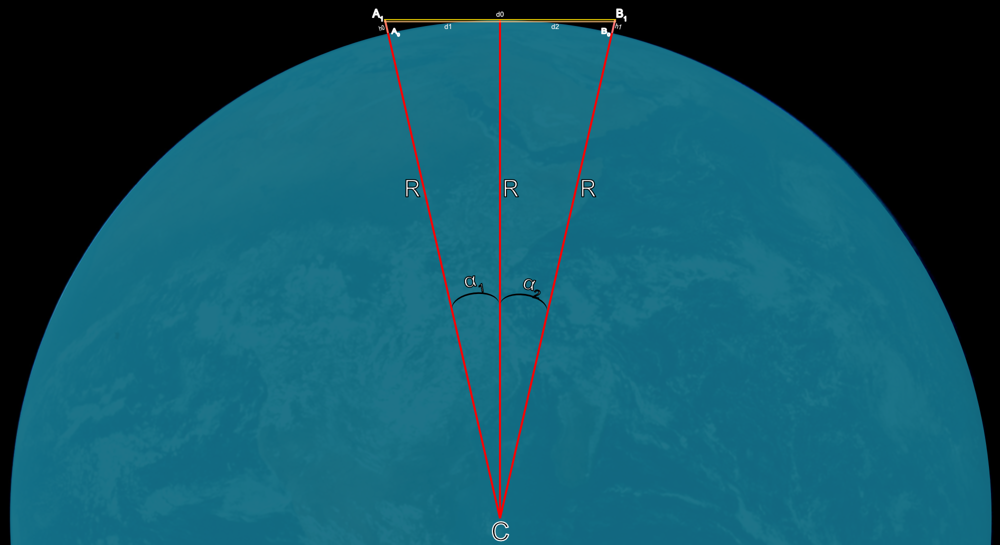
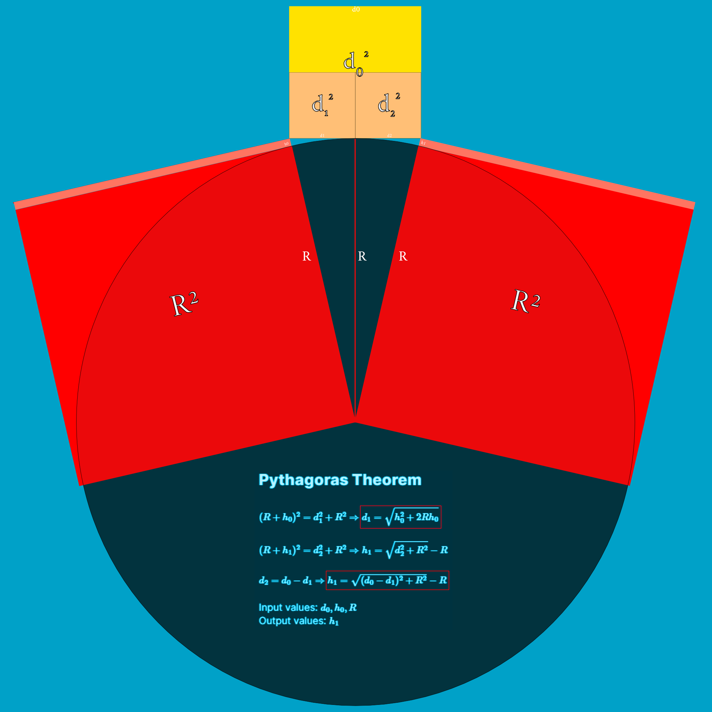
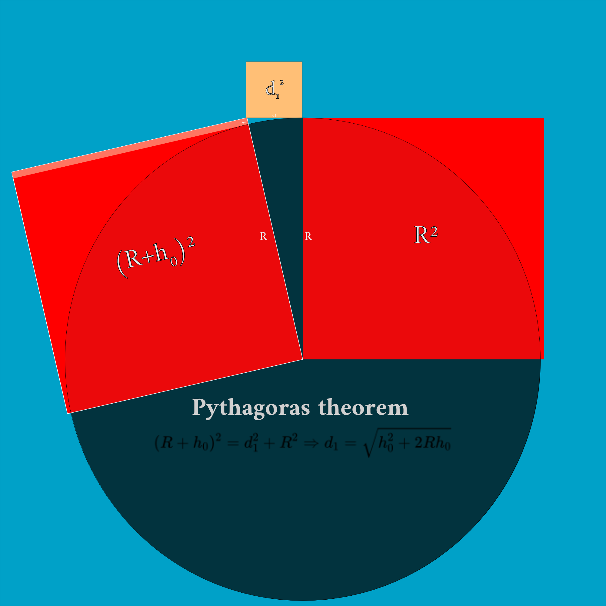
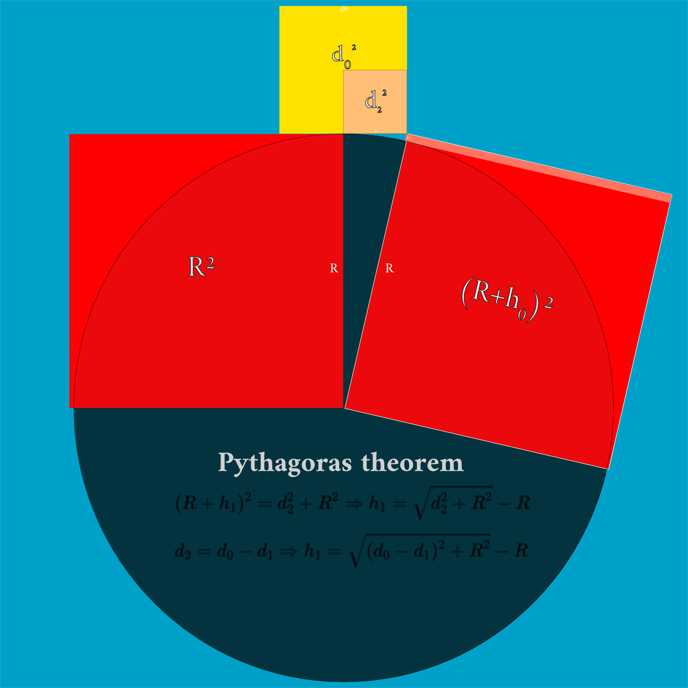

# Sphere curvature calculator
To calculate the geometrical curvature of a aphere, there are various methods.

## Scheme
- Data:
	- α: angle variation
	- d0: target distance (distance from the observer to the object)
	- d1: distance to the geometrical horizon
	- d2: distance from the geometrical horizon to the target object
	- h0: observer height
	- h1: hidden height
	- R: radius of the sphere
- Points:
	- A0: base of the observer
	- A1: height of observer
	- B0: base of hidden object
	- B1: top of hidden object 
	- C: center of the circle / sphere





Representation of a sphere of radius (R=6371 Km) with distances and heights.
![[Sphere-curve-calc]](Sphere-curve-calc.png)

## Calculation methods
There are three main methods to solve the geometrical problem. Here you can see the code to solve the math problem with python. You can compile online ([online-python.com](https://www.online-python.com/)) or local with python installed.

### 1. Pythagoras Theorem
```python
# Pythagoras with two heights, input (d0, h0, R) & output (h1)

from numpy import*

# Data: R, h_0, h_1, d_0, d_1 with same unit (ex. Km)
## hR: height along all the distance. Example: if the observer and object are separated at the shore of a lake at 200 m of altitude, the height is the same along all the distance and is not at sea level. (Default h_R = 0, sea level)

# User data
d0 = 30
h0 = 0.001
hR = 0
R = 6371 + hR

# By Pythagoras: 
# d2 = d_0 - d1, (R+h0)^2=d1^2+R^2 and (R+h1)^2=d2^2+R^2
d1 = sqrt(h_0**2+(2*R*h_0))
h1 = sqrt((d0-d1)**2+R**2)-R

print("The distance to the geometrical horizon is %.3f Km and the hidden height is %.3f Km" % (d1, h1))
```

[Graph, distance (Y axis) depends on the height (X axis)](https://www.desmos.com/calculator/cbdgduxedl)

### 2. Perimeter of a circle
```python
# Angle of curvature of a given perimeter, at sea level.

from numpy import*

## Input data (same units, e.g. Km)
R = 6371
C = 2*pi*R # C==12742*pi=40030.14 Km
d0 = 113 # From observer in Km

# Angle (in degrees) per unit, python defaults to radians
alfa_km = 2*pi/C

# Angle for given distance (d):
alfa = alfa_km*d

# Calculus of the hidden height h1:
h1 = R*(1-cos(alfa))

print("An object at a distance of %.2f km above sea level is hidden %.2f km." % (d0, h1))
```

### 3. Trigonometry
```python
# Trigonometry at sea level

from numpy import*

# Data: R, h1 (same units, e.g. Km)
R = 6371 # Earth radius (R=6371 Km)
h1 = array([1, 2, 3, 4, 5, 6, 7, 8, 9]) # Target hidden height

# Target distance : d0
d0 = R*arccos(R/(R+h1))

# Print the result
for i in range(len(h)):
  print("The hidden height is %d Km for a distance of %.2f Km" % ((i+1, d0[i])
```

## Online calculators
- [Advanced Earth Curvature Calculator](http://walter.bislins.ch/bloge/index.asp?page=Advanced+Earth+Curvature+Calculator)
- [Earth Curve Calculator](https://dizzib.github.io/earth/curve-calc/?d0=140&h0=0.2&unit=metric)
- [Make Panorama](https://www.udeuschle.de/panoramas/makepanoramas_en.htm)
