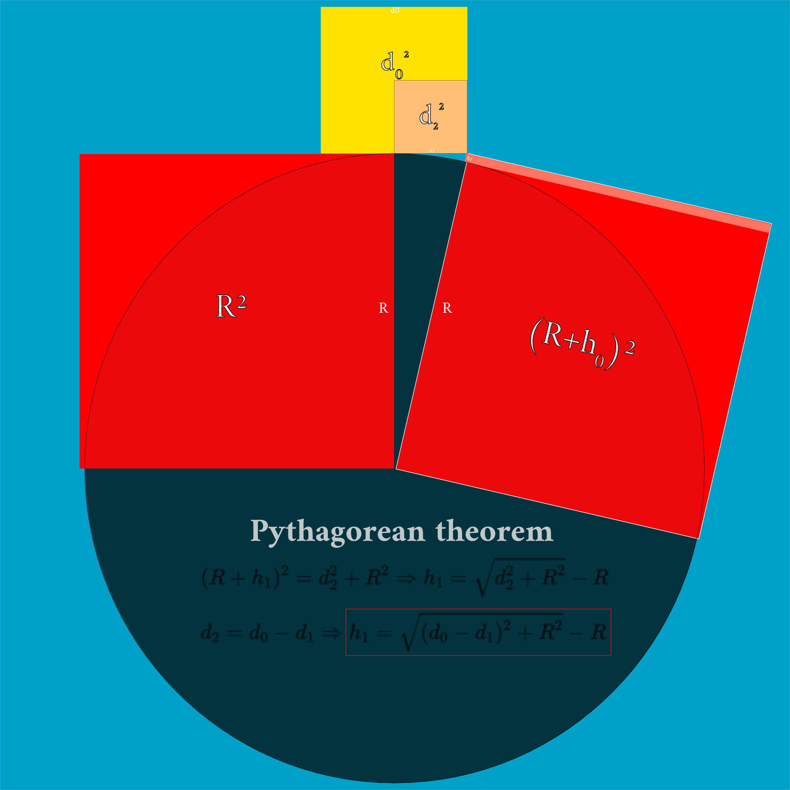

# Sphere curvature calculator
To calculate the geometrical curvature of a sphere, there are various methods.

## Scheme
- Data:
	- α: angle variation
	- d0: target distance (distance from the observer to the object)
	- d1: distance to the geometrical horizon
	- d2: distance from the geometrical horizon to the target object
	- h0: observer height
	- h1: target hidden height
	- R: radius of the sphere
- Points:
	- A0: base of the observer
	- A1: top of observer
	- B0: base of hidden object
	- B1: top of hidden object 
	- C: center of the circle / sphere




Representation of a sphere of radius (R=6371 Km) with distances and heights.
![[Sphere-curve-calc]](Sphere-curve-calc.png)

## Calculation methods
There are three main methods to solve the geometrical problem. Here you can see the code to solve the math problem with python. You can compile online ([online-python.com](https://www.online-python.com/)) or local with python installed.

### 1. Pythagorean Theorem
```python
# Pythagorean theorem with observer height, input (d0, h0, R) & output (h1)

from numpy import*

# Data: R, h0, h1, d0, d1 with same unit (e.g. Km)
## hR: elevated area along all the distance. Example: if the observer and object are separated at the shore of a lake at 200 m of altitude, 
       ## the height is the same along all the distance and is not at sea level, so would be hR = 0.2 Km. (Default hR = 0, sea level)

# User data in same unit (Km)
d0 = 30
h0 = 0.01 #  h0 = 0.01 Km = 10 m
hR = 0
R = 6371 + hR

# Pythagorean theorem: 
# d2 = d_0 - d1, (R+h0)^2=d1^2+R^2 and (R+h1)^2=d2^2+R^2
d1 = sqrt(h0**2+(2*R*h0))
h1 = sqrt((d0-d1)**2+R**2)-R

print("The distance to the geometrical horizon is %.3f Km and the hidden height is %.3f Km" % (d1, h1))
```

[Graph, distance (Y axis) depends on the height (X axis)](https://www.desmos.com/calculator/cbdgduxedl)

### 2. Perimeter of a circle
```python
# Angle of curvature of a given perimeter, at sea level.

from numpy import*

## Input data (same units, e.g. Km)
R = 6371
C = 2*pi*R # C=12742*pi=40030.14 Km
d0 = 30

# Angle (in degrees) per unit, convert python defaults radians to degrees
alfa_km = 2*pi/C

# Angle for given distance (d0):
alfa = alfa_km*d0

# Calculus of the hidden height h1:
h1 = R*(1-cos(alfa))

print("At a distance of %.2f km at sea level the hidden height by curvature is %.2f km." % (d0, h1))
```

### 3. Trigonometry
```python
# Trigonometry at sea level

from numpy import*

# Data: R, h1 (same units, e.g. Km)
R = 6371
h1 = array([0.1, 0.2, 0.3, 0.4, 0.5, 0.6, 0.7, 0.8, 0.9]) # Target hidden height

# Target distance : d0
d0 = R*arccos(R/(R+h1))

# Print the result
for i in range(len(h1)):
  print("The hidden height is %.1f Km for a distance of %.2f Km" % ((h1[i], d0[i])))
```

## Online calculators
- [Advanced Earth Curvature Calculator](http://walter.bislins.ch/bloge/index.asp?page=Advanced+Earth+Curvature+Calculator)
- [Earth Curve Calculator](https://dizzib.github.io/earth/curve-calc/?d0=31&h0=10&unit=metric)
- [Make Panorama](https://www.udeuschle.de/panoramas/makepanoramas_en.htm)
